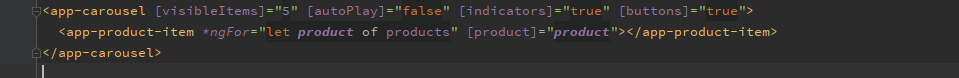
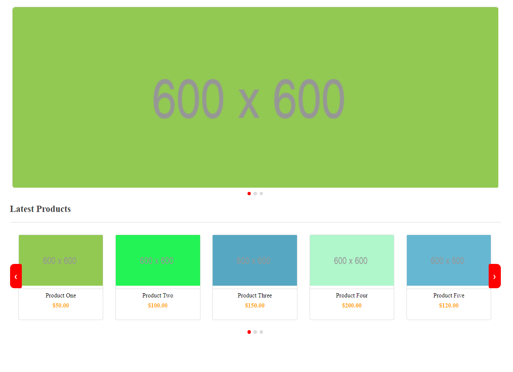
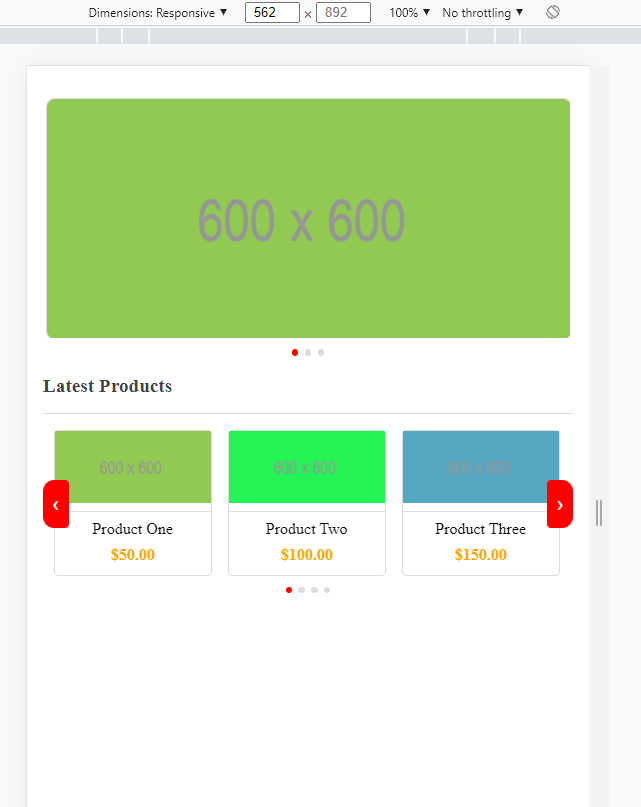
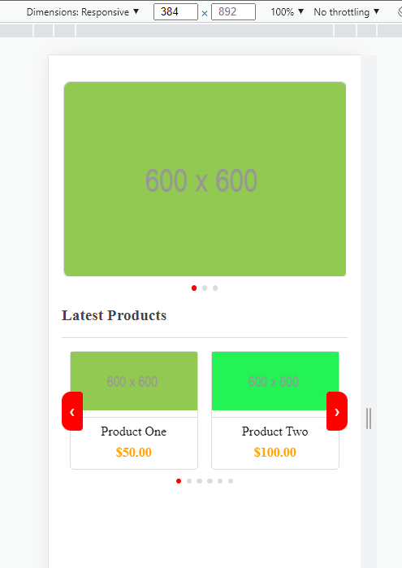
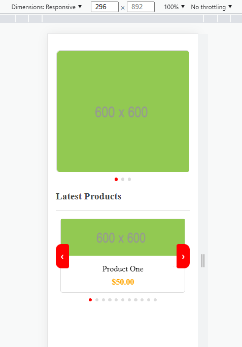

# Carousel in Angular

This is a simple carousel project with 0 third party libraries that is fully responsive and customizable created in angular

## Optional properties

1. autoPlay: true/false (optional)
- Pass this option if you want the carousel to autoplay the slides available. Works if autoPlayDuration value is greater than 0
2. buttons: true/false (optional)
- Pass this option if you want to show the previous and next navigation buttons to switch between pages/slides.
3. indicators: true/false (optional)
- Pass this option if you want to display the number of pages/slides and be able to indicate the current active page/slide
4. visibleItems: integer (optional)
- Pass this option to indicate the number of visible items you want to be present on the page on page load. if not passed, the default value is 1.
5. autoPlayDuration: integer (seconds)
- Pass this option to indicate the duration it should take to switch between slides/pages. If not provided, the autoplay functionality will not work even if it is set to true.
## Development server
Clone the project and then Run `npm install` to install the initial project dependencies and then Run `ng serve` for a dev server. Navigate to `http://localhost:4200/`. The app will automatically reload if you change any of the source files.

## Usage
Assuming you have a ProductItemComponent and you want to display 5 product items per page on your home page, below is the html markdown that you would need to add in your home page . 
- Code snippet  
   

- Appearance on a normal large window  
   

- Appearance on a (562 X 892) window  
     

- Appearance on a (384 X 892) window  
     

- Appearance on a (296 X 892) window  
     

## Disclaimer
This project hasn't been published as a library yet. If you are to use it, you can copy and paste the `carousel` folder (inclusive of the 3 files present in there) located in the `shared` folder in this project to your project folder structure. Remember to add the `CarouselComponent` as part of the declarations in your AppModule
